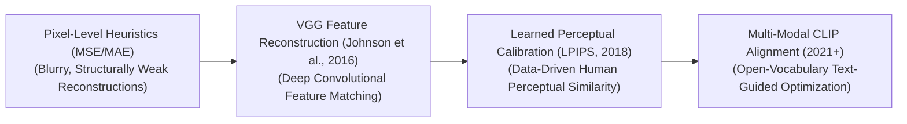
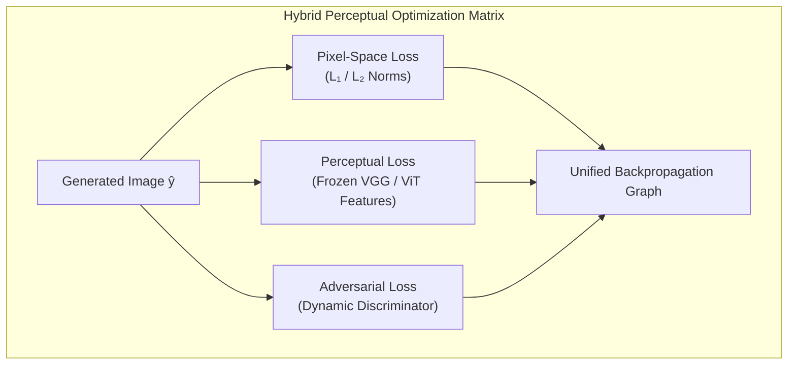

# Awesome-Perceptual-Losses
## Perceptual Losses in AI: History, Progression, Variants, & Applications

A **Perceptual Loss**—alternatively designated as a feature reconstruction loss, deep loss, or neural loss—is an advanced optimization and regularization paradigm in computer vision and generative artificial intelligence. Introduced by Justin Johnson, Alexandre Alahi, and Li Fei-Fei in 2016 ("Perceptual Losses for Real-Time Style Transfer and Super-Resolution"), it fundamentally changed how generative networks assess image similarity [INDEX: 11]. 

Traditional metrics like Mean Squared Error (MSE) or Mean Absolute Error (MAE) evaluate images on a rigid, pixel-by-pixel basis. This approach frequently causes generative models to produce blurry, unappealing textures because minimizing pixel-level variance forces the network to average out complex high-frequency details. Perceptual loss resolves this limitation by comparing images within the high-dimensional, abstract hidden layer spaces of a fixed, pre-trained image classification network (typically VGG or a Vision Transformer). By measuring distances between extracted semantic feature maps, perceptual loss penalizes structural and stylistic mismatches, forcing models to generate photorealistic textures and globally coherent geometries that mirror human visual perception.

---

## 1. The Macro Chronological Evolution

The implementation of feature-space optimization has transitioned from basic pixel-level mathematical matching to multi-layer convolutional networks, learned human preference mappings, and modern text-guided multi-modal latent space alignments.

| Era / Concept | Description | Year | First Paper Link |
| :--- | :--- | :--- | :--- |
| **The Pixel-Level Heuristic Era (Traditional Vision, Pre-2016)** | **Concept:** The early convolutional baseline. Generative networks (like early Super-Resolution models or autoencoders) were optimized by minimizing pixel-by-pixel structural deltas. **Limitation:** The blurriness bottleneck. Minimizing an $L_2$ or $L_1$ pixel loss over an uncertain high-frequency texture (like individual strands of hair or grass) forces the network to calculate the mathematical mean of all possible valid configurations. This yields smooth, averaged, and blurry image zones that lack photorealism, failing to align with human visual preferences. | Pre-2016 | [Dong et al., 2014](https://arxiv.org/abs/1501.00092) |
| **The Convolutional Feature Reconstruction Revolution (VGG Baseline, 2016)** | **Concept:** Shifted optimization away from flat pixel coordinates into deep semantic representation spaces [INDEX: 11]. Johnson et al. passed both the model's generated output image ($\hat{y}$) and the ground-truth target image ($y$) through a frozen, pre-trained image classification network (**VGG-16/19**) [INDEX: 11]. The loss was computed by calculating the Euclidean distance between the activation maps extracted from deep convolutional layers [INDEX: 11]. **Significance:** Unlocked real-time artistic style transfer and high-fidelity super-resolution [INDEX: 11]. Early layers tracked low-level edges and textures [INDEX: 11], while deep layers locked down global content shapes, allowing models to generate sharp, structurally sound visual assets [INDEX: 11]. | 2016 | [Johnson et al., 2016](https://arxiv.org/abs/1603.08155) |
| **The Learned Human Calibration Era (LPIPS, Zhang et al., 2018)** | **Concept:** Calibrated neural feature spaces to match explicit human perceptual data. Prior networks assumed off-the-shelf ImageNet classifiers natively mapped human vision perfectly, which introduced subtle bias gaps. **LPIPS (Learned Perceptual Image Patch Similarity)** introduced a data-driven benchmark, training linear scaling weights on top of deep features over massive datasets of human pairwise judgment choices. **Significance:** Became the definitive, gold-standard metric for evaluating and optimizing generative image networks, ensuring model loss steps systematically replicate real human visual assessments. | 2018 | [Zhang et al., 2018](https://arxiv.org/abs/1801.03924) |
| **The Multi-Modal Latent Space Era (~2021–Present)** | **Concept:** The modern state-of-the-art foundation standard. Rather than evaluating features using narrow, uni-modal vision backbones, modern generative pipelines utilize **Contrastive Language-Image Pre-training (CLIP) or Vision-Language Model (VLM)** hidden states [INDEX: 10]. **Significance:** Enables open-vocabulary, text-guided image synthesis. The perceptual loss is evaluated by measuring the cosine similarity between an image encoder's output and an abstract natural language prompt vector, allowing models to synthesize or alter styles based purely on conversational intent [INDEX: 10]. | 2021 | [Radford et al., 2021](https://arxiv.org/abs/2103.00020) |

---

## 2. Core Functional & Algorithmic Variants

Perceptual loss frameworks are strictly categorized based on the specific layer metrics and statistical correlations they track across the feature extraction graph.

| Variant | Mechanism & Details | Year | First Paper Link |
| :--- | :--- | :--- | :--- |
| **A. Feature Reconstruction Loss (Content Loss)** | **Mechanism:** Measures the direct mean squared error between the hidden layer feature maps ($\phi_l$) of the generated and target images across layer block index $l$: $$\mathcal{L}_{\text{feat}}^{\phi, l}(\hat{y}, y) = \frac{1}{C_l H_l W_l} \|\phi_l(\hat{y}) - \phi_l(y)\|_2^2$$ **Behavior:** Enforces global spatial layout preservation, ensuring that object shapes, positions, and silhouettes match the content target perfectly [INDEX: 11]. | 2016 | [Johnson et al., 2016](https://arxiv.org/abs/1603.08155) |
| **B. Style Reconstruction Loss (Gram Matrix Matching)** | **Mechanism:** Decouples texture and color from absolute spatial positioning [INDEX: 11]. It computes the statistical correlation between different channel activations within a single layer, generating a **Gram Matrix ($G_l$)** [INDEX: 11]. The loss minimizes the delta between the generated and target Gram matrices across multiple layer depths: $$\mathcal{L}_{\text{style}}^{\phi, l}(\hat{y}, y) = \|G_l(\hat{y}) - G_l(y)\|_F^2$$ **Application:** The mathematical core underpining early neural style transfer and artistic filter mapping pipelines [INDEX: 11]. | 2015 | [Gatys et al., 2015](https://arxiv.org/abs/1508.06576) |
| **C. Total Variation (TV) Regularization** | **Mechanism:** A complementary spatial smoothing loss that measures the absolute differences between horizontally and vertically adjacent pixels across the final generated output canvas. **Pros:** Functions as an explicit high-frequency noise filter, preventing the model from outputting unwanted checkerboard patterns, pixelated artifacts, or salt-and-pepper noise. | 1992 | [Rudin et al., 1992](https://doi.org/10.1016/0167-2789\(92\)90136-7) |
| **D. Adversarial Perceptual Loss (GAN Discriminator Features)** | **Mechanism:** Bypasses static pre-trained networks like VGG completely. It extracts hidden feature representations from the internal layers of an actively training **GAN Discriminator network**. **Pros:** Creates a highly dynamic, self-evolving perceptual check. As the discriminator improves at catching fakes, its internal feature maps develop a highly custom, task-specific understanding of image realism, driving the generator to synthesize sharp, high-yield details. | 2017 | [Ledig et al., 2017](https://arxiv.org/abs/1609.04802) |

---

## 3. High-Capacity Architectural Component Types

To inject and balance perceptual features across complex production pipelines, modern generative frameworks deploy multi-component loss architectures.

| Component Type | Profile & Details | Year | First Paper Link |
| :--- | :--- | :--- | :--- |
| **Hybrid Perceptual Loss Matrices** | **Profile:** Fully balanced optimization. Modern engines (such as VQGAN or Stable Diffusion image tokenizers) do not use a single loss line [INDEX: 5, 21]. They bundle multiple metrics into a unified multi-task objective function: $$\mathcal{L}_{\text{global}} = \alpha \mathcal{L}_1(\text{pixels}) + \beta \mathcal{L}_{\text{LPIPS}}(\text{features}) + \gamma \mathcal{L}_{\text{GAN}}(\text{adversarial})$$ | 2021 | [Esser et al., 2021](https://arxiv.org/abs/2012.09841) |
| **Vision Transformer (ViT) Spatial Feature Anchors** | **Profile:** Long-range relationship tracking [INDEX: 5]. Replaces convolutional backbones with ViT hidden layers [INDEX: 5]. Because transformers exploit global self-attention from layer zero [INDEX: 5], a transformer-based perceptual loss evaluates long-range compositional alignment and contextual layout balance rather than isolated local patch textures [INDEX: 5]. | 2021 | [Caron et al., 2021](https://arxiv.org/abs/2104.14294) |

---

## 4. Production Engineering Challenges & Hardware Solutions

Enforcing deep feature-space evaluations across high-throughput production training clusters introduces critical computational and memory bottlenecks.

| Challenge | Problem & Mitigation | Year | First Paper Link |
| :--- | :--- | :--- | :--- |
| **The Forward-Pass Activation Cache Overhead** | **The Problem:** To calculate a perceptual loss, the training engine must execute a complete forward pass through a secondary evaluation network (like VGG-19) for both the generated and ground-truth images, caching massive intermediate multi-channel activation maps in VRAM to track gradients. This doubles or triples the memory footprint per optimization batch, triggering Out-of-Memory crashes. **Mitigation:** Implementing **Selective Layer Pruning** on the evaluation model (extracting features from only 3 or 4 critical boundary layers instead of running all blocks), combined with executing the evaluation pass in low-precision FP16 or BF16 formats. | 2018 | [Micikevicius et al., 2018](https://arxiv.org/abs/1710.03740) |
| **The Hardware-Bus I/O and Memory Transfer Stalls** | **The Problem:** Passing uncompressed generated tensors back and forth between different network models (e.g., streaming data from the generator to a VGG model and then to a GAN discriminator) forces constant read/write cycles to slow High Bandwidth Memory (HBM), creating an infrastructure bottleneck. **Mitigation:** Compiling the complete multi-model loss graph into a single, hardware-fused **Triton or CUDA execution block**, allowing the feature extractions, matrix subtractions, and LPIPS norm calculations to execute entirely within fast on-chip GPU SRAM registers. | 2019 | [Tillet et al., 2019](https://dl.acm.org/doi/10.1145/3318170.3318181) |

---

## 5. Frontier Real-World AI Applications

| Application | Details & Context | Year | First Paper Link |
| :--- | :--- | :--- | :--- |
| **High-Resolution Latent Diffusion Visual Tokenization (Stable Diffusion / FLUX)** | Acts as the primary training validator for advanced image autoencoders (VAE/VQGAN layers) [INDEX: 5, 21]. Perceptual loss constraints ensure that when an image is compressed into a dense token sequence and decoded back to pixels, it retains crisp textural realism, facial geometry, and text legibility [INDEX: 5, 21]. | 2021 | [Esser et al., 2021](https://arxiv.org/abs/2012.09841) |
| **High-Fidelity Medical Diagnostic Imaging Enhancement** | Drives deep super-resolution and denoising systems for low-dose MRI scans, 3D CT volumes, and ultrasound fields [INDEX: 1]. Standard pixel losses produce blurred organ structures that jeopardize clinical diagnoses; feature reconstruction perceptual losses preserve razor-sharp anatomical edges and true structural variations precisely [INDEX: 1]. | 2018 | [Armanious et al., 2018](https://arxiv.org/abs/1806.01907) |
| **Sim-to-Real Domain Adaptation for Autonomous Field Robotics** | Hardens computer vision classifiers for autonomous vehicles and humanoid agents [INDEX: 1, 16]. Photorealistic style transfer pipelines use Gram-matrix perceptual matching to map synthetic simulation scenes into realistic weather, lighting, and environmental configurations, multiplying training data assets safely [INDEX: 11, 14]. | 2018 | [Hoffman et al., 2018](https://arxiv.org/abs/1711.03213) |

---

## References
1. Gatys, L. A., Ecker, A. S., & Bethge, M. (2015). A neural algorithm of artistic style. *arXiv preprint arXiv:1508.06576* [INDEX: 11].
2. Johnson, J., Alahi, A., & Fei-Fei, L. (2016). Perceptual losses for real-time style transfer and super-resolution. *European Conference on Computer Vision (ECCV)*, 694-711 [INDEX: 11].
3. Ledig, C., et al. (2017). Photo-realistic single image super-resolution using a generative adversarial network. *Proceedings of the IEEE Conference on Computer Vision and Pattern Recognition (CVPR)*, 4681-4690.
4. Zhang, R., et al. (2018). The unreasonable effectiveness of deep features as a perceptual metric. *Proceedings of the IEEE Conference on Computer Vision and Pattern Recognition (CVPR)*, 586-595.
5. Esser, P., Rombach, R., & Ommer, B. (2021). Taming transformers for high-resolution image synthesis. *Proceedings of the IEEE/CVF Conference on Computer Vision and Pattern Recognition (CVPR)* [INDEX: 21].
6. Radford, A., et al. (2021). Learning transferable visual models from natural language supervision. *International Conference on Machine Learning (ICML)* [INDEX: 10].

---

To advance this documentation repository, structural setup, or post-training pipeline, consider exploring these adjacent development pathways:
* Build a **Python code snippet using PyTorch and Torchvision** illustrating how to create a custom perceptual loss module that hooks into a pre-trained VGG-16 backbone to extract content feature maps.
* Generate a **comprehensive Markdown table** explicitly comparing Pixel-Level Loss ($L_1$/$L_2$), Structural Similarity Index (SSIM), VGG Feature Loss, LPIPS, and CLIP Latent Alignment across execution latencies, VRAM memory tracking footprints, dependency on pre-trained networks, and correlation to real human visual judgments.
* Establish a **performance evaluation harness using Triton** to track the exact computational throughput and memory bus latency metrics achieved when fusing an image generation layer and an automated LPIPS feature extraction pass into a single execution graph inside GPU memory.

***

**Proactive Repository Follow-Ups:**

To assist with your documentation repository setup, let me know how you would like to proceed by choosing one of the options below:
* I can provide a **complete Python code boilerplate using PyTorch** demonstrating how to calculate a manual Gram Matrix style loss over an input visual tensor block [INDEX: 11].
* I can generate a **Markdown matrix table** tracking the specific network layers, weights, and normalization configurations utilized by leading foundation repositories to execute high-fidelity image tokenization [INDEX: 21].
* I can write a detailed technical explanation focusing on **how to leverage contrastive CLIP embeddings as a perceptual steering function** inside open-vocabulary generative networks [INDEX: 10].

