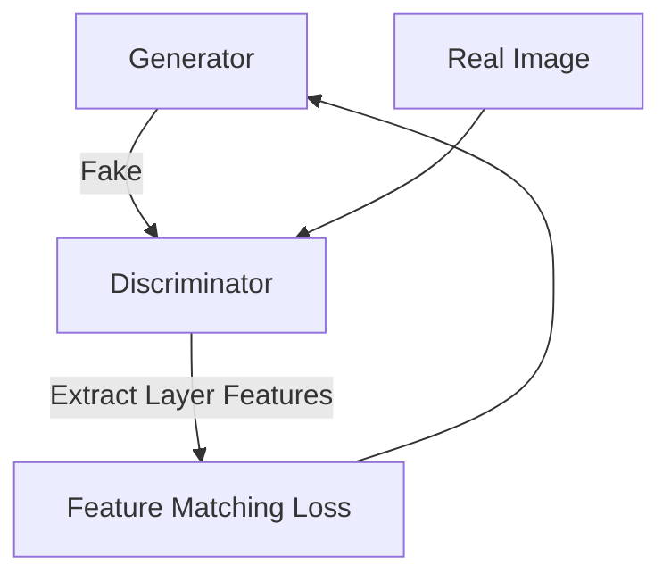

# Adversarial Perceptual Loss

Details the usage of training GAN discriminator features as a dynamic perceptual loss.

---

## Architecture Diagram

---

## Detailed Explanation

### Overview
Rather than utilizing static pre-trained classifiers, adversarial perceptual loss extracts features from intermediate layers of a dynamically training GAN discriminator.

### Key Mechanics
- Discriminator features adapt as training progresses.
- Generator is forced to align its distribution with real features.

### Pros & Cons
- **Pros:** Highly adaptive, matches the specific target dataset, generates crisp textures.
- **Cons:** Highly unstable training dynamics, risk of mode collapse.

---

[← Back to README](../README.md)
