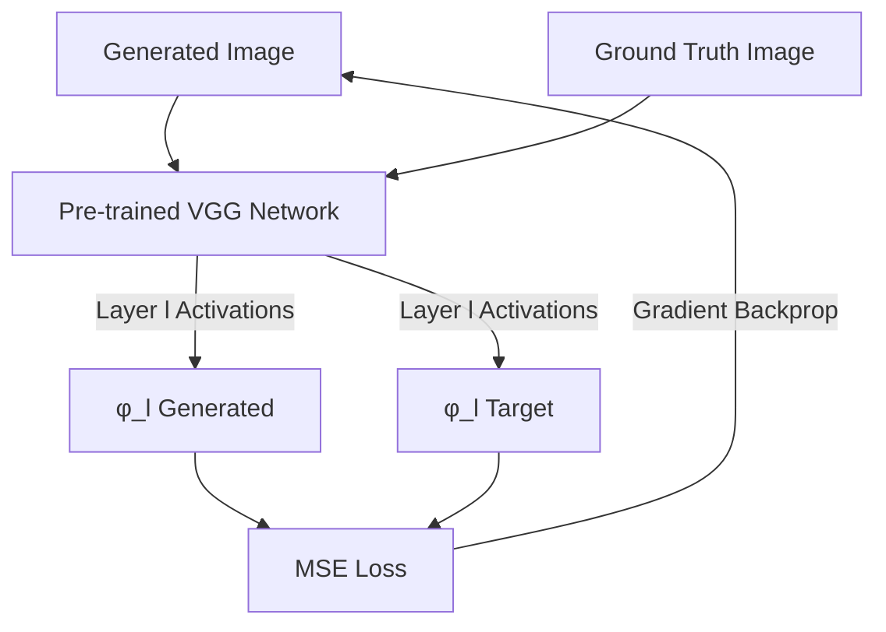

# Convolutional Feature Reconstruction

Details the seminal shift from pixel-level coordinate optimization to semantic feature-space matching using pre-trained VGG networks.

---

## Architecture Diagram

---

## Detailed Explanation

### Overview
Introduced by Johnson et al. in 2016, this paradigm extracts semantic feature maps from frozen intermediate layers of pre-trained image classifiers (mostly VGG) to measure perceptual similarity.

### Key Mechanics
- Passes both target and generated images through the network.
- Computes L2 distance between feature maps of intermediate layers.
- Early layers retain spatial structures, while deeper layers capture high-level semantics.

### Pros & Cons
- **Pros:** Preserves spatial structures, produces sharp textures, aligns better with human perception.
- **Cons:** Pre-trained network dependency, higher memory consumption, classification network bias.

---

[← Back to README](../README.md)
