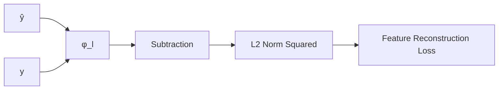

# Feature Reconstruction Loss

Covers the mathematical and architectural aspects of VGG-based content matching.

---

## Architecture Diagram

---

## Detailed Explanation

### Overview
Feature reconstruction loss (or content loss) evaluates semantic geometry by tracking squared differences of hidden layer activation maps.

### Mathematical Formulation
$$\mathcal{L}_{	ext{feat}}^{\phi, l}(\hat{y}, y) = rac{1}{C_l H_l W_l} \|\phi_l(\hat{y}) - \phi_l(y)\|_2^2$$

### Pros & Cons
- **Pros:** Preserves overall structural layout, position, and shape.
- **Cons:** Ignores fine-grained style details when used in isolation.

---

[← Back to README](../README.md)
