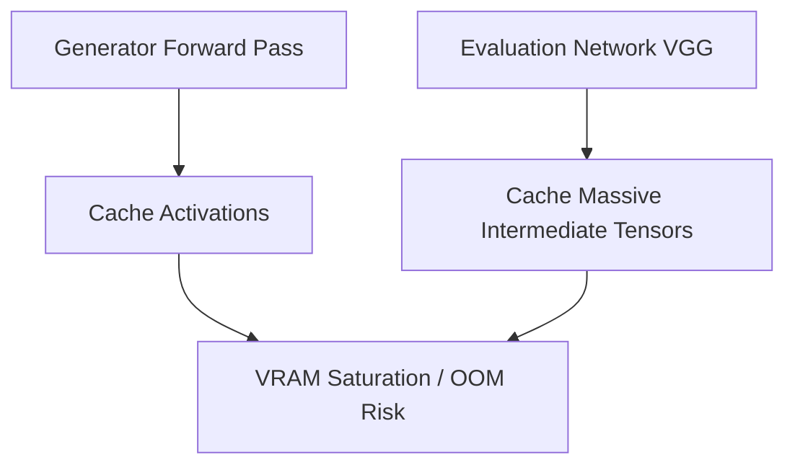

# Forward-Pass Activation Cache Overhead

Explains VRAM memory bottlenecks due to caching intermediate layer activations.

---

## Architecture Diagram

---

## Detailed Explanation

### Overview
Evaluating perceptual loss requires executing forward passes on secondary evaluation models, which caches massive intermediate activations, leading to memory bottlenecks.

### Mitigations
- **Selective Layer Pruning:** Only extract features from 3-4 specific layers instead of all blocks.
- **Mixed Precision:** Execute the evaluation pass in low-precision FP16 or BF16 formats.

### Pros & Cons of Mitigations
- **Pros:** Significantly reduces VRAM footprint, increases training throughput.
- **Cons:** Can slightly degrade target reconstruction quality.

---

[← Back to README](../README.md)
