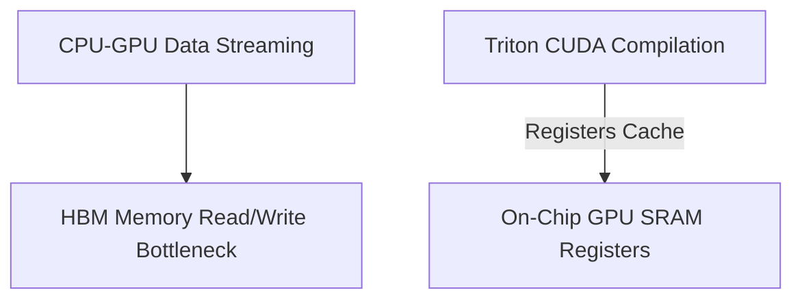

# Hardware-Bus I/O and Memory Transfer Stalls

Addresses hardware performance bottlenecks during tensor transfers and the compilation of unified loss graphs.

---

## Architecture Diagram

---

## Detailed Explanation

### Overview
Streaming generated tensors back and forth between different network architectures can saturate high bandwidth memory (HBM) and create transfer bottlenecks.

### Mitigations
- Compiling the loss pipeline into a unified CUDA or Triton graph.
- Keeping intermediate computations entirely on-chip within GPU SRAM registers.

### Pros & Cons
- **Pros:** Maximizes hardware utilization, reduces latency.
- **Cons:** Increases compilation time, requires custom CUDA/Triton knowledge.

---

[← Back to README](../README.md)
