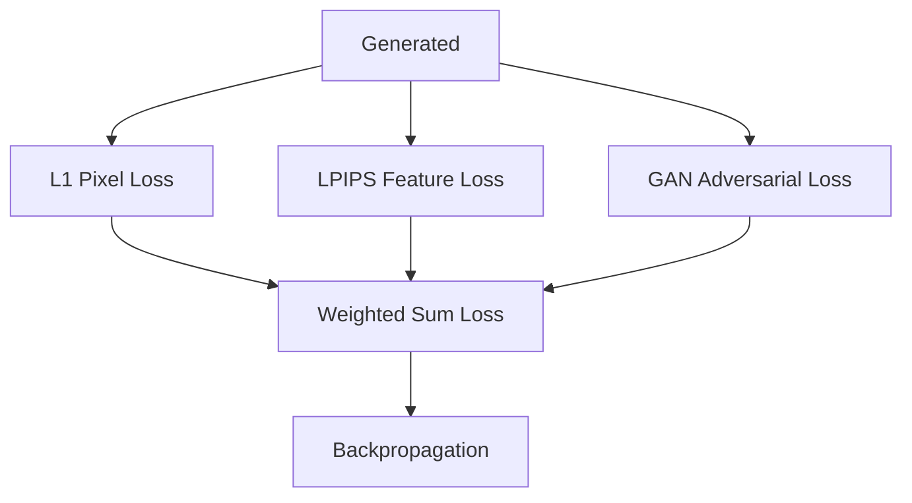

# Hybrid Perceptual Loss Matrices

Covers multi-objective loss matrices combining pixel, perceptual, and adversarial objectives.

---

## Architecture Diagram

---

## Detailed Explanation

### Overview
Modern generative pipelines combine multiple loss components (pixel, perceptual, adversarial) to balance fidelity, style, and structure.

### Mathematical Formulation
$$\mathcal{L}_{	ext{global}} = lpha \mathcal{L}_1(	ext{pixels}) + eta \mathcal{L}_{	ext{LPIPS}}(	ext{features}) + \gamma \mathcal{L}_{	ext{GAN}}(	ext{adversarial})$$

### Pros & Cons
- **Pros:** Combines structural correctness (pixel loss) with photorealism (GAN/LPIPS).
- **Cons:** Requires extensive hyperparameter tuning for weight balancing.

---

[← Back to README](../README.md)
