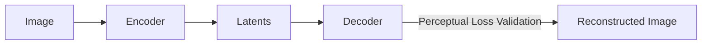

# Latent Diffusion Visual Tokenization

Covers perceptual loss functions in training visual autoencoders for diffusion models.

---

## Architecture Diagram

---

## Detailed Explanation

### Overview
In latent diffusion architectures like Stable Diffusion, perceptual losses ensure that visual tokenization preserves critical structural details (like text legibility and faces).

### Applications
- Autoencoders (VAE/VQGAN) training.
- Ensuring high-fidelity compression and decompression.

### Pros & Cons
- **Pros:** Retains fine-grained details in highly compressed latent spaces.
- **Cons:** Autoencoder artifacts can propagate to the diffusion process.

---

[← Back to README](../README.md)
