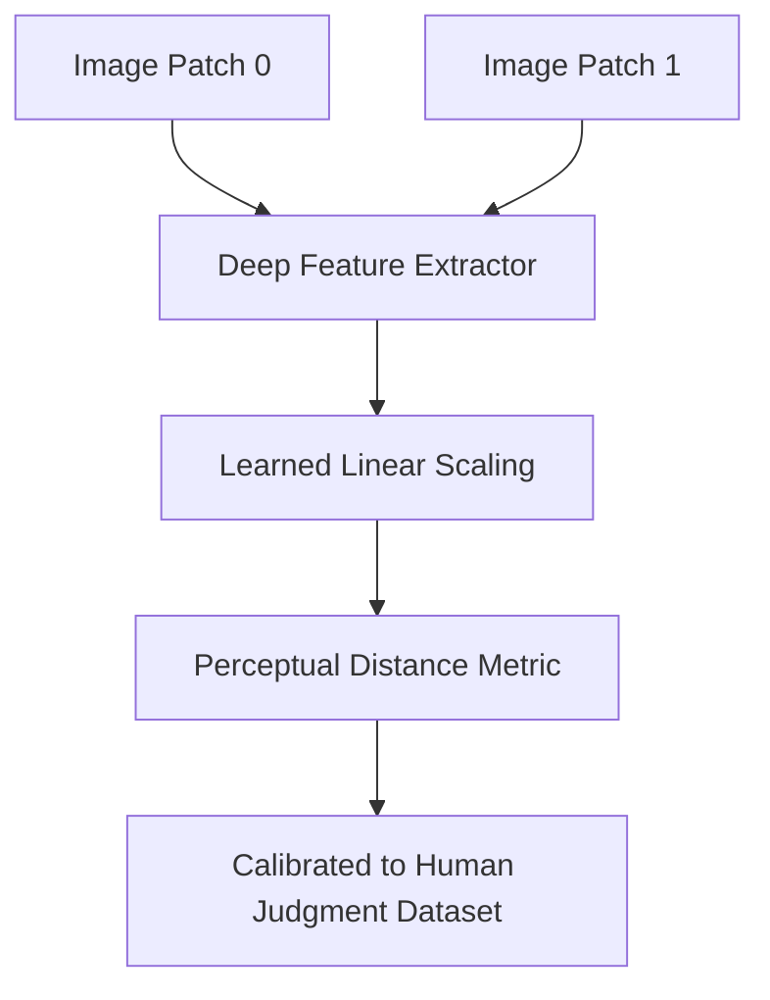

# Learned Human Calibration (LPIPS)

Details the LPIPS framework calibration technique, which uses human judgment datasets to scale deep neural features.

---

## Architecture Diagram

---

## Detailed Explanation

### Overview
LPIPS (Learned Perceptual Image Patch Similarity) was introduced by Zhang et al. in 2018. It calibrates deep network feature spaces to match explicit human perceptual judgments.

### Key Mechanics
- Extracts features from networks like VGG, AlexNet, or ResNet.
- Learns linear weights to scale features such that distances match human perceptual labels.
- Validated on a large dataset of human pairwise preferences.

### Pros & Cons
- **Pros:** Highly correlated with human visual ratings, robust across various generation tasks.
- **Cons:** Computationally heavy, depends on the quality of human labeling datasets.

---

[← Back to README](../README.md)
