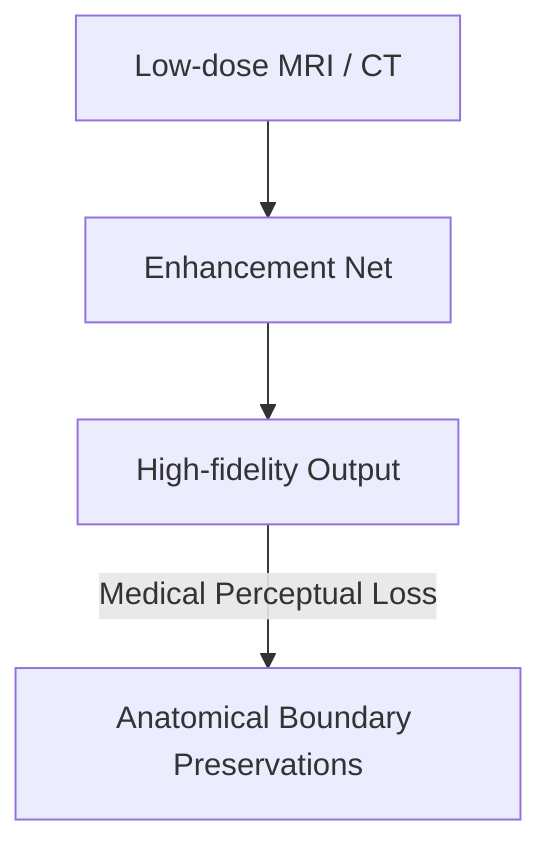

# Medical Diagnostic Imaging Enhancement

Explores how perceptual losses improve medical image translation and super-resolution.

---

## Architecture Diagram

---

## Detailed Explanation

### Overview
Applying standard pixel losses to medical images results in blurry features. Perceptual loss preserves anatomical structures and fine edges essential for diagnosis.

### Applications
- Low-dose MRI/CT denoising and super-resolution.
- Cross-modal medical translation (e.g., CT to MRI).

### Pros & Cons
- **Pros:** Retains diagnostic-quality anatomical edges and structures.
- **Cons:** Risk of generating realistic-looking synthetic artifacts (hallucinations).

---

[← Back to README](../README.md)
