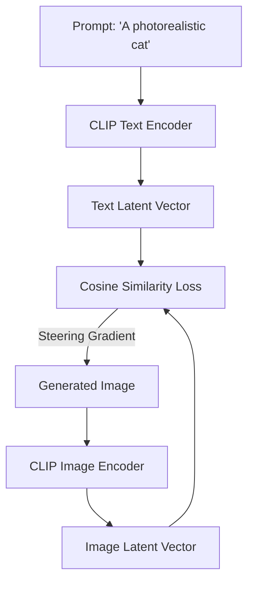

# Multi-Modal Latent Space Era

Explains how joint contrastive vision-language models (e.g. CLIP) steer perceptual similarity matching.

---

## Architecture Diagram

---

## Detailed Explanation

### Overview
Uses joint text-image representation models like CLIP (Radford et al., 2021) to define loss functions based on language descriptions or general multi-modal conceptual alignment.

### Key Mechanics
- Evaluates the cosine similarity between prompt embedding vectors and generated image encoder features.
- Enables steering image content without pixel-level targets.

### Pros & Cons
- **Pros:** No target image required, enables text-guided editing, abstract style understanding.
- **Cons:** Prone to adversarial vulnerabilities, sensitive to prompt phrasing.

---

[← Back to README](../README.md)
