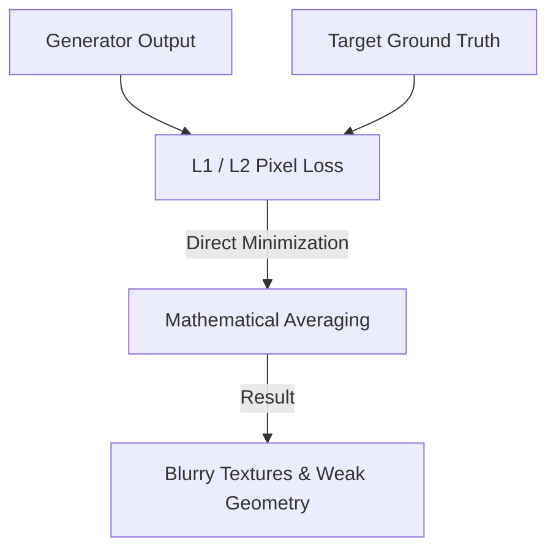

# Pixel-Level Heuristic Era

Explores the early era of optimization in computer vision prior to the widespread adoption of deep perceptual losses, highlighting why pixel-level heuristics lead to blurry results.

---

## Architecture Diagram

---

## Detailed Explanation

### Overview
The Pixel-Level Heuristic Era represents the foundational phase of computer vision and image generation where models were optimized using mathematical pixel-by-pixel comparisons (like L1/L2 loss).

### Key Mechanics
- Evaluates difference on a strict coordinate system ($x,y$).
- No awareness of global context, edges, or texture structures.
- Minimizing mean squared error forces the network to output the mean of all possible high-frequency configurations.

### Pros & Cons
- **Pros:** Fast to compute, no external pre-trained model required, simple mathematical formulation.
- **Cons:** Yields extremely blurry images, lacks realistic high-frequency detail, does not align with human visual perception.

---

[← Back to README](../README.md)
