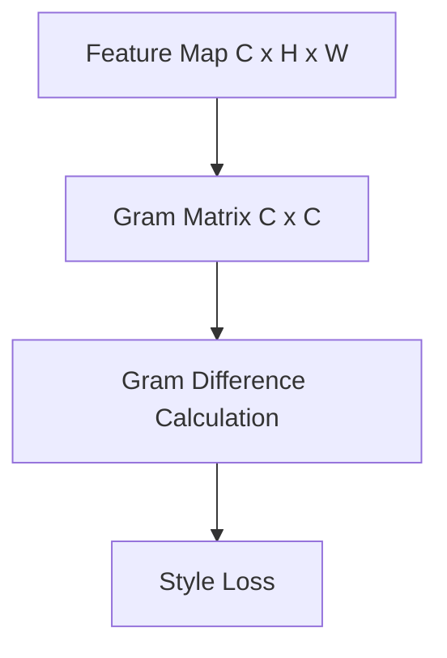

# Style Reconstruction Loss

Examines texture and style matching using Gram Matrix activation correlations.

---

## Architecture Diagram

---

## Detailed Explanation

### Overview
Style loss computes spatial correlations across feature channels using a Gram Matrix, separating style/texture from structural layout.

### Mathematical Formulation
$$\mathcal{L}_{	ext{style}}^{\phi, l}(\hat{y}, y) = \|G_l(\hat{y}) - G_l(y)\|_F^2$$

### Pros & Cons
- **Pros:** Highly effective for capturing artistic style, texture, and color palettes.
- **Cons:** Loses spatial localization, can cause structural distortion if weighted too heavily.

---

[← Back to README](../README.md)
