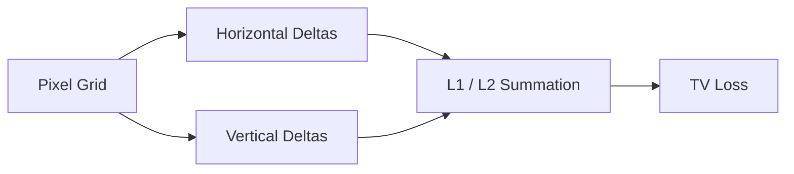

# Total Variation (TV) Regularization

Details TV regularization as a spatial smoothing and high-frequency noise filter.

---

## Architecture Diagram

---

## Detailed Explanation

### Overview
Total Variation (TV) regularization is a classic smoothing constraint that penalizes rapid, high-frequency pixel variations to prevent noise.

### Key Mechanics
- Measures differences between adjacent pixels.
- Acts as a low-pass filter to reduce checkerboard and grid artifacts.

### Pros & Cons
- **Pros:** Reduces noise and artifacts, enforces local spatial consistency.
- **Cons:** Can over-smooth real textures, making details look plasticky if over-penalized.

---

[← Back to README](../README.md)
