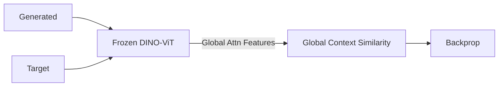

# Vision Transformer (ViT) Perceptual Loss

Details the shift to transformer-based backbones to exploit global self-attention for perceptual metrics.

---

## Architecture Diagram

---

## Detailed Explanation

### Overview
Replaces CNN feature extraction with Vision Transformers (ViT) to leverage self-attention and capture long-range layout context.

### Key Mechanics
- Self-attention maps capture global layout dependencies.
- Particularly useful with self-supervised models like DINO.

### Pros & Cons
- **Pros:** Excellent long-range context preservation, robust layout matching.
- **Cons:** Extremely high memory footprint and computation latency.

---

[← Back to README](../README.md)
